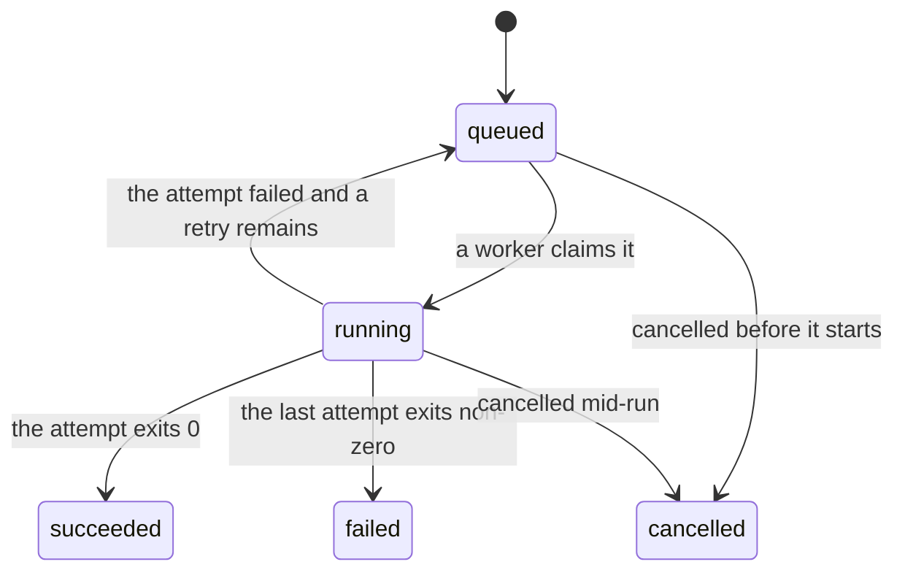

<!-- Example. Part of the example docs tree shipped with living-project-documentation. -->

# Scheduling

How work is defined and gets run. This domain covers job templates and their
schedules, the jobs those produce, how an attempt is retried, and what outlives a
job's own record.

## Templates and schedules

A job template carries a name, the work to run, and an optional schedule. The name is
unique across the account and is what job history is grouped by, so renaming a
template regroups every job it has already produced.

A template with a schedule produces one job each time the schedule fires, evaluated in
UTC. A schedule that fires while the previous job is still running produces a second
job rather than skipping; the two run concurrently, subject to the worker pool's own
limit. A template with no schedule produces jobs only when someone runs it by hand.

A template is enabled or disabled. A disabled template's schedule does not fire and it
cannot be run by hand, but disabling does not touch jobs already created — a job
queued a moment earlier is still claimed and still runs.

Editing a template does not change jobs already created: each job carries a copy of
the work it was created with, so a template edited while a job is queued runs the old
definition once more.

## Creating a job

Both a firing schedule and a manual run produce the same record, and nothing
distinguishes them afterwards except the job's `trigger` field.

A new job is queued rather than started where it was created, and a fixed pool of
workers consumes the queue, so peak concurrency is a number someone chooses rather
than the number the schedules happen to add up to. Starting a run inline, on the timer
thread that noticed its schedule fire, is what once let forty templates sharing a 09:00
schedule exhaust the database connection pool and take the API down with them.
Rate-limiting that thread is not the alternative it looks like — the coupling between
scheduling and execution turned the burst into an outage, not the rate — and a
per-template concurrency cap bounds one template at a time while leaving the total,
which is the number that actually ran out, unbounded.

The queue costs a job its immediate start: a job created while the pool is saturated
waits, and the product cannot tell a caller for how long. A worker's claim is
idempotent, because a queue between the two halves can lose a job in a way an inline
start could not.

## States

A job is `queued` when created, `running` from the moment a worker claims it, and ends
in `succeeded`, `failed`, or `cancelled`.

A job cancelled while running keeps whatever output its attempt had already written.
The product does not roll it back.

## Attempts and retries

A failed attempt is retried up to three times, at one, five, and twenty-five minutes
after the failure. The job stays `queued` between attempts, so a job waiting on a
retry is indistinguishable from a job waiting on a free worker.

A job that exhausts its retries ends `failed`, carrying the last attempt's exit status
and the tail of its output. Earlier attempts' output is kept until the job's record is
pruned.

## Output and pruning

A job's record is pruned thirty days after it ends. Its job output outlives the record
and is addressed by the job's identifier, so a link to output written last quarter
still resolves once the job it came from is gone.

## What scheduling does not do

A job does not trigger another job. There is no dependency graph, no fan-out, and no
"run this once that succeeds" — a template needing a second step runs it inside its
own work.
