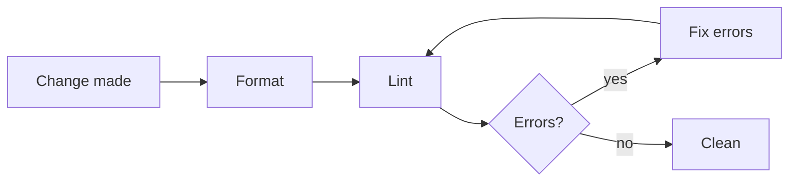

# Code Quality

Apply these rules whenever you write or modify code.

The project's own format and lint commands are what these rules run; find them where the project documents them, per [project-docs.md](./project-docs.md), rather than assuming an invocation.

## Check Sequence

The order matters because the linter reports problems the formatter alone does not resolve, so a passing format step is not proof the code is clean.

- The format command applies auto-fixable formatting. The lint command enforces the lint rules — and, in toolchains where the linter also checks formatting (e.g. Biome), re-flags format issues the formatter missed. In toolchains where it does not (e.g. ESLint with `eslint-config-prettier`), both steps are still always required.

**Guidelines:**

- MUST always run checks in this order after making any code change:
  1. **Format** (the project's format command) — auto-formats all modified files.
  2. **Lint** (the project's lint command) — detects code quality and remaining format issues.
  3. **Fix all reported errors.**
  4. **Re-run lint** — confirm all errors are resolved.

- MUST NOT skip or reorder these steps.

## Formatting

Delegating whitespace and layout to the formatter keeps diffs free of style noise and ends manual formatting debates in review.

**Guidelines:**

- MUST run the project's format command after every set of code changes, before committing or considering the task done.
- MUST NOT manually adjust spacing, indentation, or line endings — let the formatter handle them.
- MUST NOT submit code that has not been passed through the formatter.

## Linting

The linter catches correctness and quality problems the formatter cannot see (and, when it also enforces format rules, re-flags any that slipped past the formatter).

**Guidelines:**

- MUST run the project's lint command after formatting to surface code quality issues.
- MUST fix every lint **error** before considering the task complete.
- SHOULD fix lint **warnings** in any file that was modified as part of the task. MAY also fix pre-existing warnings in those files.
- MUST NOT suppress lint rules with the linter's inline suppression directive unless there is a clear, documented reason why the rule cannot be satisfied.
  - When suppression is genuinely necessary, add an inline comment on the same line explaining the reason.

## Comments

There are two kinds of comment, each with its own style: **doc-comments** that document an API, and **line comments** that explain a specific spot in the code. Both are written in the comment voice below. These rules apply to source-code comments only, not to commit messages — which the project's Conventional Commits practices own — or to prose documentation.

### Comment Voice

The voice is stated here rather than inferred from the surrounding files, because inferring it fails exactly when it matters. A codebase drifts the moment one large change is written in a different style, and from then on the surrounding files answer two ways — so a rule that points at them hands the next author whichever answer they happened to open, and no linter can see the disagreement. A stated voice answers once.

Comment prose is lowercase, and emphasis comes from what a sentence says rather than from capitalising a word. All-caps shouts at a reader who has no way to tell an emphasised word from an identifier, and it decays fastest in the comments that carry the most weight, where several emphasised phrases in one paragraph leave none of them emphatic.

**Guidelines:**

- MUST write comment prose in lowercase, first word of a sentence included, unless the word keeps its own casing under the rule below.
- MUST NOT use all-caps for emphasis. Rewrite the sentence so its structure carries the emphasis, or drop the emphasis.
- MUST keep the real casing of anything whose casing is part of its identity — proper nouns, code identifiers, file and directory paths, environment variable names, format and protocol names, and acronyms. Lowercasing `GITHUB_TOKEN` or `sha256` names something else.
- MUST keep a linter suppression directive in the tool's required casing; only the trailing human-readable reason follows the comment voice.
- MUST follow the project's own comment convention instead of this default where the project documents one. A project documents a convention by stating it — in its contributor documentation or its agent instructions — not by having source files that exhibit it.

### Doc-Comments

Doc-comments carry the API-level documentation, written in the project's doc-comment standard. A public surface without one forces every consumer to read the implementation to learn what it does.

**Guidelines:**

- MUST give every exported/public type definition, and every function whose body exceeds ~5 lines, a doc-comment in the project's doc-comment standard stating what it is or does.
- MUST document the conditions under which a function throws, using the standard's throws tag (e.g., `@throws`) when the standard supports one.
- SHOULD add parameter/return documentation only when the name and type do not already make the meaning obvious; do NOT add restating noise.

### Line Comments

Line comments earn their place: a comment that merely restates the next line adds reading cost without information, while a missing "why" comment leaves the next reader to rediscover the reason.

**Guidelines:**

- MUST keep line comments minimal — write one only when control flow, a business rule, or a non-obvious reason is not conveyed by the code alone — and remove a comment that only restates the code it precedes.
- MUST NOT delete a comment that explains a "why", an edge case, or non-obvious behavior.
- MUST let the linter/formatter enforce comment conventions where it can, and fix any comment-style violations it reports.

## Import Hygiene

Stale imports misrepresent a module's real dependencies and can drag dead code — or another runtime's code — into the bundle.

**Guidelines:**

- MUST NOT leave unused imports in modified files. The linter will flag these, but resolve them proactively.
- MUST NOT use barrel re-export files (an `index` module that re-exports everything) as import sources when a direct import path is available. Import directly from the module file.
  - This keeps bundle size small and avoids accidentally pulling in code intended for one runtime/boundary into another.
- SHOULD use type-only imports when the language supports them and the imported symbol is a type that is not used as a value.
