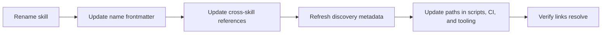

# Cross-Referencing and Discovery

Apply this reference whenever a skill cites another skill, a reference file is added or renamed, or a skill is added, renamed, moved, or removed.

## Skill-to-Skill References Resolve by Topic

A skill must stay individually portable — liftable to a user-, organization-, or global-level skill root without dragging its siblings along. A relative-path link into another skill (`../other-skill/SKILL.md`, or worse a deep `../other-skill/references/topic.md`) breaks the moment that sibling is not co-located, so it defeats per-skill portability. Instead, a cross-skill reference names the neighbor's **topic** — the rule or practice it owns — and lets the agent resolve it through native skill discovery, where each skill advertises itself with its own `description`/`when_to_use`. The reader loads the owning skill when the task matches that skill's trigger, so the reference need not hard-code a skill name or a path. Links **inside** the same skill stay relative — a skill carries its own `references/` folder wherever it moves.

**Example:**

```markdown
Consult the project's verification-evidence practices when a review finding depends on test coverage.
```

**Guidelines:**

- MUST reference another skill by the topic or rule it owns (e.g. "the project's change-management rules"), never by a relative or repo-root-absolute path.
- MUST NOT link into another skill by path — neither its `SKILL.md` front door nor, especially, its `references/` files.
- MUST NOT deep-link into another skill's `references/`; name the owning topic (e.g. "the project's change-management rules") and let that skill's own progressive disclosure surface the detail.
- MUST keep the topic phrasing specific enough to resolve to exactly one owning skill; where neighboring skills share a topic space (e.g. end-to-end vs. unit testing), keep the distinguishing token that separates them.
- MUST use leading-dot relative paths for links inside the same skill, such as `./references/topic.md`; these stay relative because they move with the skill.
- MAY use root-relative paths from a repo-root document (e.g. a working agreement, or a written index where the host maintains one) when the host renderer resolves them reliably.
- MUST verify that every intra-skill relative link still resolves on disk, and that every cross-skill reference still names a topic a discoverable skill owns.

## No Content Duplication

Duplicated rules rot independently. A citing skill may summarize a neighbor's rule, but the detailed requirement should live in one source skill.

**Guidelines:**

- MUST keep each rule's detailed wording in exactly one source skill.
- MUST NOT copy full rule wording into multiple skills for convenience.
- SHOULD provide a one-line summary plus a topic-based reference when another skill needs context.
- MUST move duplicated guidance back to one owner when overlap appears.

## Triggering Conditions on Cross-Skill References

A cross-skill reference should tell the agent when to consult the neighbor. This avoids loading broad doctrine for tasks that do not need it, and is the part that survives the switch from paths to topics — the routing condition, not the link, is what drives correct skill activation.

**Guidelines:**

- MUST state the condition under which a cross-skill reference should be followed.
- SHOULD make the trigger specific enough that the agent can decide not to follow it.
- MUST NOT use a bare "See also" reference without a routing condition.
- SHOULD put cross-skill references near the section where the adjacent topic arises.

## Skill Discovery and Optional Index Sync

Native discovery is the routing authority: each skill advertises when it applies through its own `description`/`when_to_use`, and the agent loads a skill when the task matches that trigger. If a skill's discovery metadata is stale or missing, discovery fails before skill content can help. Some hosts additionally maintain a written index (e.g. an `AGENTS.md` table); where one exists, keep it in sync, but a skill must stay discoverable without it.

**Guidelines:**

- MUST keep each skill's `description`/`when_to_use` accurate when a skill is added, renamed, moved, or removed, so native discovery routes to it.
- MUST ensure every topic named by a cross-skill reference is owned by a skill whose discovery metadata will surface it, since discovery is what resolves those references.
- SHOULD keep discovery metadata concise and trigger-focused.
- MUST, when the host also maintains a written index, add a new skill to it, remove a deleted skill from it, and never leave it pointing at deleted or renamed skills.
- MUST verify every written-index entry touched by the change, where such an index exists.

## Parent SKILL.md Sync

The parent `SKILL.md` is the routing table for Markdown topic files under `references/`. Reference-file changes are incomplete until the parent route is accurate and every `./references/...` link resolves.

**Guidelines:**

- MUST update the parent `SKILL.md` when adding, deleting, or renaming a reference file.
- MUST ensure every reference file is linked from the parent `SKILL.md`.
- MUST keep split skill topic files under `references/` and link them as `./references/<topic>.md` from the parent `SKILL.md`.
- MUST refresh the parent description when new reference content changes the skill's discovery scope.
- MUST delete or wire in orphan reference files.

## Link Resolution Check

Link checks catch quiet skill failures — a renamed reference file or moved link target that leaves a relative link dangling. They are especially important after renames because broken links may not fail tests. This skill ships a checker at `scripts/check-links.sh`: it walks every Markdown file under the given roots (default: the whole tree, including dot-directories that `glob('**/*.md')` sweeps skip), ignores links inside fenced code blocks, inline code spans, and HTML comments, and exits non-zero when any relative `.md` link fails to resolve. It sees Markdown-link syntax only, so topic-based cross-skill references are outside its scope — verify those by confirming each names a topic a discoverable skill owns.

**Example:**

```sh
# From the repository root; pass paths to narrow the scan.
.claude/skills/agent-skill-authoring/scripts/check-links.sh
```

**Example Verification Flow:**



**Guidelines:**

- MUST verify that intra-skill relative links resolve, and that every cross-skill reference names a topic a discoverable skill owns, before finalizing a skill-tree change.
- SHOULD run this skill's `scripts/check-links.sh` for that verification instead of checking links by hand.
- MUST update directory name, `name` frontmatter, cross-references, discovery metadata (and any written index the host maintains), and role-profile references together during a rename, along with every tooling path that names the skill — CI workflows, run-scripts, and hooks that invoke its `scripts/`, which break silently because the link check sees only Markdown links.
- SHOULD include touched skill paths in the change summary for rename or consolidation work.
- MUST NOT finalize a skill move while any old path or stale topic reference remains.
