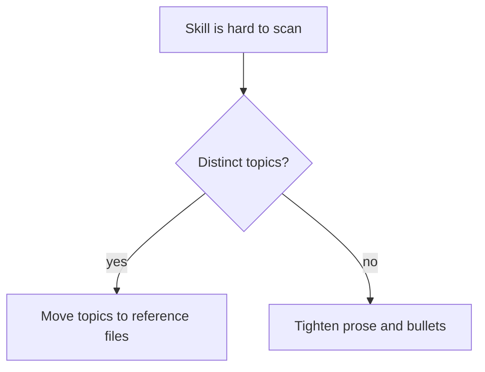

# Scoping and MECE

Apply this reference when deciding what a skill covers, where its boundary sits against neighbors, and whether new guidance needs its own skill.

## Coherent Unit

A skill should describe one unit of work that is loaded, applied, and revised together. If two responsibilities would usually be needed by different prompts, they usually belong in different skills.

**Good Examples:**

> code-review-guidelines owns review reporting and severity.

> quality-assurance-guidelines owns verification evidence.

**Bad Example:**

> review-and-test-and-security-guidelines owns three separate decision contexts.

**Guidelines:**

- MUST encapsulate a single coherent unit of work in each skill.
- SHOULD scope a skill so the directory name signals its responsibility.
- SHOULD split responsibilities that belong to different decision contexts.
- MUST NOT make two skills responsible for the same rule.

## Mutual Exclusivity

Mutual exclusivity prevents drift. When two skills need the same guidance, choose one source of truth and make the other skill link to it under a clear trigger condition.

**Guidelines:**

- MUST verify that a new or revised skill does not duplicate responsibility already owned by a sibling skill.
- MUST choose one home when a rule appears to fit two skills.
- SHOULD sharpen neighboring skill boundaries when readers are likely to pick the wrong skill.
- MUST NOT duplicate rule wording across skills for convenience.

## Portable Source Exception

A self-contained skill authored for installation into other projects (a `skills/`-sourced skill) is a sanctioned exception to strict mutual exclusivity: it MAY restate a rule that a repo-native skill owns, because it must stand alone where that owner is absent. The exception is bounded — the portable skill still defers to the host project's owner when one exists, and it is not a license to duplicate freely.

**Guidelines:**

- MAY let a self-contained, installable source skill restate a rule owned by a repo-native skill when portability requires the skill to stand alone.
- MUST have the portable skill defer to the host project's owning skill when that owner is present, rather than competing with it.
- MUST NOT invoke this exception to duplicate a rule between two repo-native skills, or between two portable sources, where a single owner would serve.
- SHOULD keep the restated copy a concise summary that points to the fuller owner, not a divergent second source of truth.

## Collective Exhaustiveness

Within its declared scope, a skill should cover the practical cases an agent will encounter. Gaps are acceptable only when the skill narrows its scope or points to a different owner.

**Guidelines:**

- SHOULD address every reasonable responsibility inside the skill's declared scope.
- MUST either fill an in-scope gap or narrow the stated scope so the gap is no longer promised.
- MAY list out-of-scope concerns when the boundary is easy to misunderstand.
- SHOULD cross-reference the source skill when an adjacent topic is intentionally out of scope.

## When to Split

Splitting is a remedy for bloat or mixed topics, not a formatting preference. A split should make the skill easier to load selectively.

**Example:**

**Guidelines:**

- SHOULD split a skill when `SKILL.md` crosses the size thresholds in [progressive-disclosure.md](./progressive-disclosure.md).
- SHOULD split when one section exceeds the section-length ceiling (below).
- SHOULD split when the `description` and `when_to_use` together cannot cover what and when within the discovery length caps (see [frontmatter-and-naming.md](./frontmatter-and-naming.md)).
- SHOULD NOT split a small, cohesive skill only to match neighboring file layouts.

## When to Consolidate

Consolidation removes dead-weight routing. Two skills that trigger on the same prompts and repeat the same content usually need one owner, not two entry points.

**Guidelines:**

- SHOULD consolidate skills whose descriptions trigger on the same prompts and whose bodies substantially overlap.
- SHOULD consolidate a forwarding-only skill into the skill it forwards to.
- MUST pick and document the source-of-truth skill during consolidation.
- MUST update cross-references and index links in the same change.

## Section-Length Ceiling

Section length is a readability signal. When a section needs too many bullets, the topic is probably hiding subtopics.

**Guidelines:**

- SHOULD keep each substantive section near seven guideline bullets.
- MUST NOT exceed ten guideline bullets without stating why the exception is necessary.
- SHOULD split an overgrown section into clearer subsections or move detail into a reference file.
- MAY use H3, H4, or deeper headings when they clarify hierarchy without hiding the source-of-truth rule.
- MUST apply the ceiling independently to `SKILL.md`, nested subsections, and each reference file.

## Naming Aligned with Scope

The skill name is the first boundary cue a future agent sees. A capability name such as `code-review` is clearer than an actor or file-type name such as `reviewer-skill`.

**Guidelines:**

- MUST choose a directory name that signals the skill's responsibility.
- SHOULD name the responsibility, not the actor or storage format.
- SHOULD rename a skill when refactoring changes its scope.
- MUST resolve conceptual overlap before choosing between similar names.
