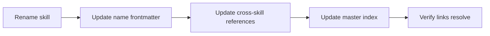

# Cross-Referencing and Index Sync

Apply this reference whenever a skill cites another skill, a reference file is added or renamed, or a skill is added, renamed, moved, or removed.

## Skill-to-Skill References Resolve by Name

A skill must stay individually portable — liftable to a user-, organization-, or global-level skill root without dragging its siblings along. A relative-path link into another skill (`../other-skill/SKILL.md`, or worse a deep `../other-skill/references/topic.md`) breaks the moment that sibling is not co-located, so it defeats per-skill portability. Instead, a cross-skill reference names the neighbor descriptively and lets the agent resolve it through the master skill index (`AGENTS.md`), which is always the discovery authority. Links **inside** the same skill stay relative — a skill carries its own `references/` folder wherever it moves.

**Example:**

```markdown
Consult the project's quality-assurance guidelines when a review finding depends on test coverage.
```

**Guidelines:**

- MUST reference another skill by a descriptive, index-resolvable name (e.g. "the project's quality-assurance guidelines"), never by a relative or repo-root-absolute path.
- MUST NOT link into another skill by path — neither its `SKILL.md` front door nor, especially, its `references/` files.
- MUST NOT deep-link into another skill's `references/`; name the owning skill and its topic (e.g. "the project's development guidelines (change-management rules)") and let that skill's own progressive disclosure surface the detail.
- MUST keep the descriptive name specific enough to resolve to exactly one master-index row; where neighboring skills share a topic space (e.g. end-to-end vs. unit testing), keep the distinguishing token that separates them.
- MUST use leading-dot relative paths for links inside the same skill, such as `./references/topic.md`; these stay relative because they move with the skill.
- MAY use root-relative paths from a repo-root document (e.g. the master index) when the host renderer resolves them reliably.
- MUST verify that every intra-skill relative link still resolves on disk, and that every cross-skill name still matches a master-index row.

## No Content Duplication

Duplicated rules rot independently. A citing skill may summarize a neighbor's rule, but the detailed requirement should live in one source skill.

**Guidelines:**

- MUST keep each rule's detailed wording in exactly one source skill.
- MUST NOT copy full rule wording into multiple skills for convenience.
- SHOULD provide a one-line summary plus a name-based reference when another skill needs context.
- MUST move duplicated guidance back to one owner when overlap appears.

## Triggering Conditions on Cross-Skill References

A cross-skill reference should tell the agent when to consult the neighbor. This avoids loading broad doctrine for tasks that do not need it, and is the part that survives the switch from paths to names — the routing condition, not the link, is what drives correct skill activation.

**Guidelines:**

- MUST state the condition under which a cross-skill reference should be followed.
- SHOULD make the trigger specific enough that the agent can decide not to follow it.
- MUST NOT use a bare "See also" reference without a routing condition.
- SHOULD put cross-skill references near the section where the adjacent topic arises.

## Master Skill Index Sync

The master index is the host project's routing table. If it points to missing skills or omits new ones, discovery fails before skill content can help.

**Guidelines:**

- MUST update the master skill index when a skill is added, renamed, moved, or removed.
- MUST add a new skill to the appropriate topic or role section when the host index uses those sections.
- MUST ensure every skill named by a cross-skill reference has a matching master-index row, since the index is what resolves those names.
- MUST NOT leave the master index pointing at deleted or renamed paths.
- SHOULD keep index descriptions concise and trigger-focused.
- MUST verify every master-index link touched by the change.

## Parent SKILL.md Sync

The parent `SKILL.md` is the routing table for Markdown topic files under `references/`. Reference-file changes are incomplete until the parent route is accurate and every `./references/...` link resolves.

**Guidelines:**

- MUST update the parent `SKILL.md` when adding, deleting, or renaming a reference file.
- MUST ensure every reference file is linked from the parent `SKILL.md`.
- MUST keep split skill topic files under `references/` and link them as `./references/<topic>.md` from the parent `SKILL.md`.
- MUST refresh the parent description when new reference content changes the skill's discovery scope.
- MUST delete or wire in orphan reference files.

## Link Resolution Check

Link checks catch quiet skill failures — a renamed reference file or moved index target that leaves a relative link dangling. They are especially important after renames because broken links may not fail tests. This skill ships a checker at `scripts/check-links.sh`: it walks every Markdown file under the given roots (default: the whole tree, including dot-directories that `glob('**/*.md')` sweeps skip), ignores links inside fenced code blocks, inline code spans, and HTML comments, and exits non-zero when any relative `.md` link fails to resolve. It sees Markdown-link syntax only, so name-based cross-skill references are outside its scope — verify those by confirming each name resolves to a master-index row.

**Example:**

```sh
# From the repository root; pass paths to narrow the scan.
.claude/skills/agent-skills-best-practices/scripts/check-links.sh
```

**Example Verification Flow:**



**Guidelines:**

- MUST verify that intra-skill and index relative links resolve, and that every cross-skill reference names a real index row, before finalizing a skill-tree change.
- SHOULD run this skill's `scripts/check-links.sh` for that verification instead of checking links by hand.
- MUST update directory name, `name` frontmatter, cross-references, master-index entries, and role-profile references together during a rename.
- SHOULD include touched skill paths in the change summary for rename or consolidation work.
- MUST NOT finalize a skill move while any old path remains in the index.
