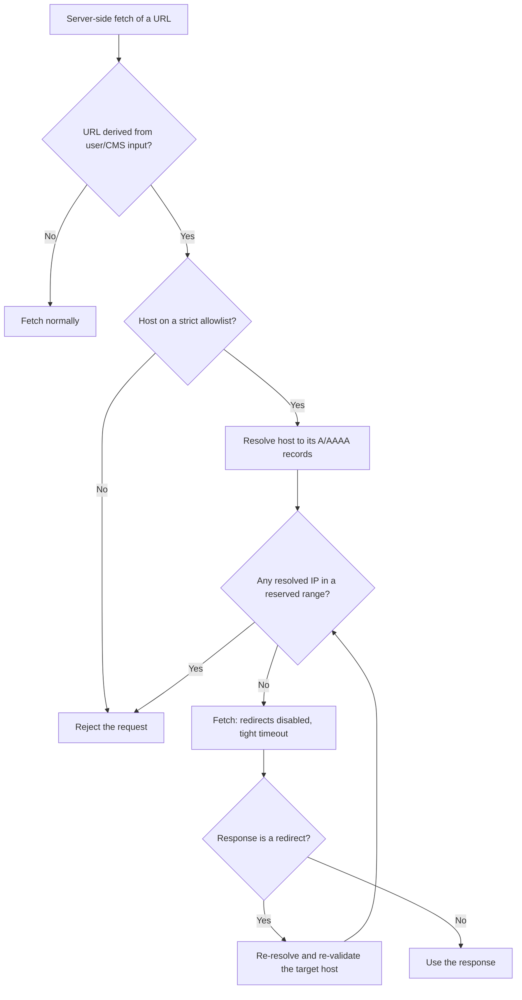

# SSRF and Outbound Fetch

Keep server-side outbound `fetch` calls from being steered at internal-network or unintended targets by user- or CMS-controlled content, in two modes. **Build:** allowlist the destination and validate the resolved IP before the request leaves the server. **Review:** verify a change cannot fetch an attacker-chosen host. (In OWASP Top 10:2025, SSRF is folded into A01 Broken Access Control.)

## Build Securely

The reliable defense is a positive allowlist plus validation of the _resolved_ IP — a denylist of bad ranges is bypass-prone and belongs at the network layer as defense-in-depth, not as the primary control. Attackers exploit legitimate features (redirects, DNS rebinding), so validate after resolution and after every redirect.

Reserved ranges and cloud-metadata targets to reject after resolution:

| Range or host                                               | What it is                                          |
| ----------------------------------------------------------- | --------------------------------------------------- |
| `127.0.0.0/8`, `::1/128`                                    | Loopback / `localhost`                              |
| `10.0.0.0/8`, `172.16.0.0/12`, `192.168.0.0/16`             | RFC 1918 private networks                           |
| `169.254.0.0/16` (incl. `169.254.169.254`), `fd00:ec2::254` | Link-local, incl. AWS/Azure cloud-metadata endpoint |
| `224.0.0.0/4`                                               | Multicast                                           |
| `metadata.google.internal`, `*.internal`                    | Internal hostnames, incl. GCP metadata              |

**Guidelines:**

- MUST prefer an allowlist of exact trusted hosts over a denylist of bad ranges; use a denylist only as a last resort when the destination is genuinely user-open, and treat it as bypass-prone.
- MUST accept a discrete host or IP as input where the feature allows, rather than a whole URL, to avoid URL-parser-ambiguity bypasses.
- MUST resolve the host and reject the request if any resolved A/AAAA address falls in a reserved range above — validate the resolved IP, not just the URL string.
- MUST disable redirect following (`redirect: "manual"`) on an untrusted-URL fetch, or re-resolve and re-validate the final host after each redirect to defeat DNS rebinding.
- MUST scope an image-host or external-host allowlist entry to a single exact origin, never a wildcard.
- SHOULD pass a tight timeout (e.g., `signal: AbortSignal.timeout(<ms>)`) so a hung internal endpoint cannot stall the request.
- SHOULD protect a mutation endpoint from CSRF by checking `Origin` / `Sec-Fetch-Site` (or a shared-secret header for internal-hook callers), since browsers attach the victim's cookies to cross-site requests.

## The Outbound-Fetch Risk Surface

Any function that performs a server-side `fetch(url)` where `url` originates from authored/user-controlled content (e.g., a link-preview / embed fetcher that resolves URLs from content) is the principal SSRF surface. Identify the project's equivalents and apply the rules below.

**Guidelines:**

- MUST flag a Critical when the diff removes the URL-validity check (e.g., `URL.canParse(href)`) on an authored URL before it flows into a fetch, without replacing it with a stricter check. That parse is often the only filter keeping malformed URLs out.
- MUST flag a Major when the diff adds a new caller that `fetch`-es a user- or CMS-controlled URL without a hostname allowlist or a block-list for internal ranges (e.g., `127.0.0.0/8`, `169.254.169.254` — the cloud metadata endpoint, `10.0.0.0/8`, `172.16.0.0/12`, `192.168.0.0/16`, `localhost`, `*.internal`).
- MUST flag a Major when a new server-side `fetch` follows redirects (the default `redirect: "follow"`) without checking the final `response.url` host against an allowlist. A redirect can land on an internal host even when the initial URL passes the allowlist.
- SHOULD flag a Minor recommendation that any new outbound fetch passes a tight timeout (e.g., `signal: AbortSignal.timeout(<ms>)`) so a hung internal endpoint does not stall the request.

## Image Optimization and Remote Hosts

The image-host allowlist defines which external origins the server will fetch on a visitor's behalf, so a wildcard entry delegates that fetch capability to every host it matches.

- A pre-existing optimized-image component may use an "unoptimized" escape hatch for an externally fetched image URL — flag a Critical only if the diff worsens this (e.g., promotes the image to an eagerly-preloaded position, or replaces the framework's `<Image>`-style component with a raw ``).

**Guidelines:**

- MUST flag a Major when a new entry in the config allowlist of external hosts uses a wildcard hostname or covers more than one origin. Existing entries should be tightly scoped to a single origin.
- MUST flag a Critical when a new component renders a media element with an "unoptimized" / host-check-bypassing source for a user- or CMS-controlled URL whose host is not validated. The "unoptimized" path skips the remote-host allowlist check.

## Social-Preview / Sitemap / Robots

Metadata routes run server-side with no user session in front of them, which makes a fetched URL parameter an unauthenticated proxy into the server's network position.

**Guidelines:**

- MUST flag a Critical when a social-preview image route accepts a `src` query parameter that flows into `fetch(src)` without an allowlist. This is the canonical OG-image SSRF pattern.
- MUST flag a Major when sitemap or robots generation performs an unbounded `fetch` to a user- or CMS-controlled URL — those should fetch only data through the project's data-access layer.

## CSRF on Mutation Endpoints

Browsers attach the victim's cookies to cross-site requests automatically, so an unprotected mutation endpoint can be driven by any page the victim merely visits.

**Guidelines:**

- MUST flag a Major when a new mutation handler (`POST`, `PUT`, `PATCH`, `DELETE`) does not check the `Origin` or `Sec-Fetch-Site` header for cross-site requests. Even idempotent endpoints can be abused (e.g., to flush caches).
- SHOULD recommend a shared-secret header for new mutation endpoints invoked only by internal hooks (e.g., a data-layer lifecycle hook that triggers revalidation).

## Out-of-Scope

If the data/content layer ships its own admin UI under a dedicated route segment, that segment owns its own CSRF and request validation and is out of scope for this lens. If the project defines a code-review skill with diff-scoping rules, follow its exclusion of tool-owned directories; otherwise treat that segment as owning its own request validation.

**Guidelines:**

- MUST NOT flag findings inside a tool-owned admin route segment; the data/content layer owns its CSRF and request validation there. If the project defines a code-review skill with diff-scoping rules, defer to it for which directories are excluded.
