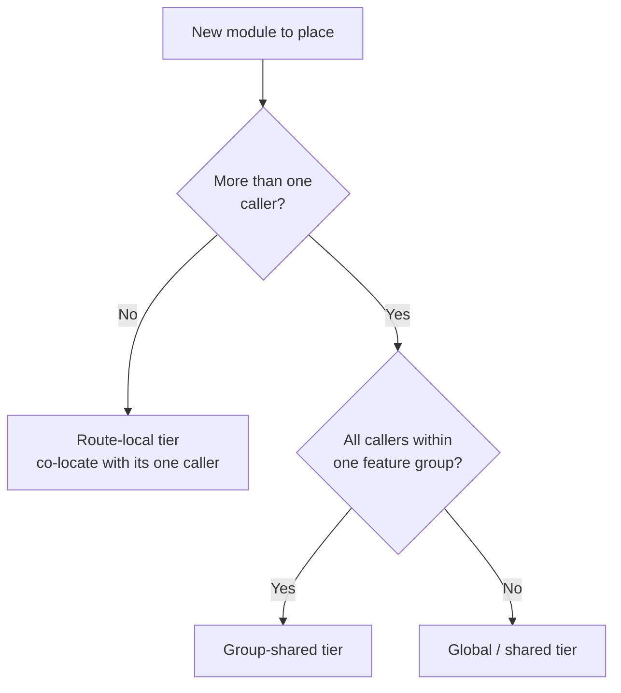

# Naming and Organization

Apply this reference to place changed files where they belong with the name they should carry — while writing them, and while reviewing where someone else put them.

## File Naming

A file that breaks the surrounding naming convention is harder to locate and makes readers and tooling second-guess what kind of module it is.

**Guidelines:**

- MUST name a new source/style file on the project's file-naming convention; a name that breaks it — `RecordHeader.tsx` or `record_header.tsx` in a kebab-case project — is the finding while reviewing.
- MUST give a new component the co-located sibling file its convention requires (e.g., a paired style-module file when the component renders styled DOM); a missing sibling is the finding.
- SHOULD match a co-located sibling's base name to its primary file (e.g., `record-header.tsx` with `record-header.module.css`, not `header.module.css`) when the convention is matched base names.

## Directory Tier

Place shared logic at the lowest tier that has more than one caller. Most projects progress from route-local code, to a group-shared tier, to a global/shared tier — a module planted too high invites unrelated callers, and one planted too low gets copied when a second caller appears.

| Tier            | When to use                                       |
| --------------- | ------------------------------------------------- |
| Route-local     | Used only by the files of one route/feature       |
| Group-shared    | Used by ≥ 2 routes/features within the same group |
| Global / shared | Used broadly across the application               |

Resolve the tier from the caller count, not from where a file is convenient to drop:

**Guidelines:**

- MUST place a module used by only one route/feature in that route's local tier; the same module sitting in a group-shared or global tier is the finding — pull it down.
- MUST promote a route-local module to the lowest shared tier covering all its callers once a second route/feature imports it; a route-local file imported across routes is the finding.
- MUST keep a helper or component out of any location the framework would misinterpret (e.g., a non-route file dropped directly into a directory the framework treats as a route segment).

## Route File Layout

When a change adds or moves a route/feature, follow the project's own routing convention, if it defines one — placement conventions are project-specific, so this is a conditional rule, skipped where the project has none. Typical co-location expectations include:

- A props/types module co-located with the route entry, declaring the route's input shape (params and query, including any framework-required async typing).
- A not-found / fallback module co-located when the route can fail to resolve (e.g., a dynamic record id/slug that may not exist).
- Social-image / metadata asset files co-located with the route they belong to.
- A request handler living in its own sub-directory, never colliding with a route's page entry.

**Guidelines:**

- MUST place added or moved files per the project's own structure or routing convention, if it defines one, before considering the placement settled; where the project defines none, this rule does not apply.

## Identifier Naming

A symbol named or cased unlike its neighbors makes the reader stop to check whether the difference carries meaning.

**Guidelines:**

- MUST match a new identifier's casing and pattern to its neighborhood; the finding is a symbol that breaks it — e.g.:
  - A symbol cased differently from its siblings (`PascalCase` where siblings use `camelCase`, or vice versa).
  - A data-access function that breaks the sibling naming pattern (`fetchRecord` when siblings are `getRecord`, `getRecords`, `getSettings`).
- SHOULD prefer full words over opaque abbreviations in a new identifier (`record`/`user`, not `rec`/`usr`).
- SHOULD keep a value on the project's established suffix/alias convention for its kind (e.g., an unresolved async value carrying the expected naming alias), per the project's own component convention, if it defines one.
