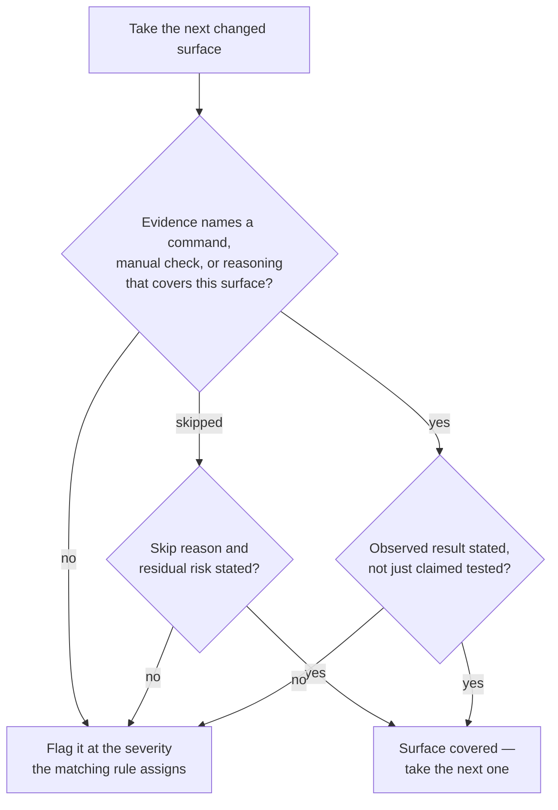

# Verification Evidence

Apply these rules when reviewing whether the author proved the change works. Verification evidence is the observable record of checks performed, not a general claim that the change was tested.

## Evidence-Adequacy Decision Flow

Walk every changed surface through this flow; the change's evidence is adequate only when each surface exits at "covered". The severity of each flag is assigned by the specific rule that covers it — the sections below and the project's review severity tiers.

## Evidence Required Before Completion

A review should connect each changed surface to the command, manual check, or reasoning that covers it.

**Guidelines:**

- MUST require `npm run format` and `npm run lint` evidence after code or documentation edits.
- MUST require manual evidence for changed output surfaces listed in [manual-verification.md](./manual-verification.md).
- MUST map skipped required checks to a concrete reason and residual risk.
- MUST require a second-pass verification statement after fixing any finding the project's review severity tiers rank as Critical or Major.

## Evidence Format

Evidence should be short but specific enough that another reviewer can see what was covered.

**Guidelines:**

- SHOULD state each command with its observed result, such as "`npm run lint` passed" or "`npm run format` reported no changes".
- SHOULD name manual routes or surfaces checked, such as "the record-detail page in its non-default content state rendered the expected banner".
- SHOULD include relevant log, screenshot, or diff context when the result is not obvious from command success alone.
- MUST NOT accept "tested manually" or "looks fine" without the route, state, or behavior that was checked.
- MUST NOT accept a passing command as coverage for a surface the command does not exercise.
