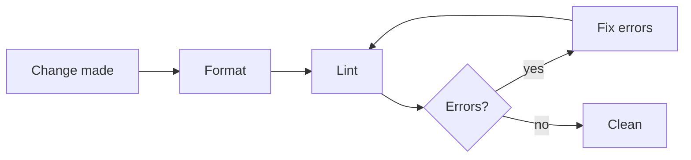

# Code Quality

Apply these rules whenever you write or modify code in this project.

## Check Sequence

The order matters because the linter reports problems the formatter alone does not resolve, so a passing format step is not proof the code is clean.

- `npm run format` applies auto-fixable formatting. `npm run lint` enforces the lint rules — and, in toolchains where the linter also checks formatting (e.g. Biome), re-flags format issues the formatter missed. In toolchains where it does not (e.g. ESLint with `eslint-config-prettier`), both steps are still always required.

**Guidelines:**

- MUST always run checks in this order after making any code change:
  1. **Format** (`npm run format`) — auto-formats all modified files.
  2. **Lint** (`npm run lint`) — detects code quality and remaining format issues.
  3. **Fix all reported errors.**
  4. **Re-run lint** — confirm all errors are resolved.

- MUST NOT skip or reorder these steps.

## Formatting

Delegating whitespace and layout to Prettier keeps diffs free of style noise and ends manual formatting debates in review.

**Guidelines:**

- MUST run `npm run format` after every set of code changes, before committing or considering the task done.
- MUST NOT manually adjust spacing, indentation, or line endings — let Prettier handle them.
- MUST NOT submit code that has not been passed through the formatter.

## Linting

The linter catches correctness and quality problems the formatter cannot see (and, when it also enforces format rules, re-flags any that slipped past the formatter).

**Guidelines:**

- MUST run `npm run lint` after formatting to surface code quality issues.
- MUST fix every lint **error** before considering the task complete.
- SHOULD fix lint **warnings** in any file that was modified as part of the task. MAY also fix pre-existing warnings in those files.
- MUST NOT suppress lint rules with markdownlint-cli2's inline suppression directive unless there is a clear, documented reason why the rule cannot be satisfied.
  - When suppression is genuinely necessary, add an inline comment on the same line explaining the reason.

## Comments

This project distinguishes two kinds of comment, each with its own style: **doc-comments** that document an API, and **line comments** that explain a specific spot in the code. Existing source files are the authority for both — read them before writing comments and match their voice. These rules apply to source-code comments only, not to commit messages (see [commit-messages.md](./commit-messages.md)) or to prose documentation.

### Doc-Comments

Doc-comments carry the API-level documentation, written in the project's doc-comment standard. A public surface without one forces every consumer to read the implementation to learn what it does.

**Guidelines:**

- MUST give every exported/public type definition, and every function whose body exceeds ~5 lines, a doc-comment in the project's doc-comment standard stating what it is or does.
- MUST document the conditions under which a function throws, using the standard's throws tag (e.g., `@throws`) when the standard supports one.
- SHOULD add parameter/return documentation only when the name and type do not already make the meaning obvious; do NOT add restating noise.

### Line Comments

Line comments earn their place: a comment that merely restates the next line adds reading cost without information, while a missing "why" comment leaves the next reader to rediscover the reason.

**Guidelines:**

- MUST write line comments in the project's chosen comment voice; read the surrounding source files before adding comments and match what is already there. Proper nouns, code identifiers, and acronyms keep their natural casing regardless of the voice.
- MUST keep line comments minimal — write one only when control flow, a business rule, or a non-obvious reason is not conveyed by the code alone — and remove a comment that only restates the code it precedes.
- MUST NOT delete a comment that explains a "why", an edge case, or non-obvious behavior.
- MUST keep a linter suppression directive in the tool's required casing; only the trailing human-readable reason follows the project's comment voice.
- MUST let the linter/formatter enforce comment conventions where it can, and fix any comment-style violations it reports.

## Import Hygiene

Stale imports misrepresent a module's real dependencies and can drag dead code — or another runtime's code — into the bundle.

**Guidelines:**

- MUST NOT leave unused imports in modified files. The linter will flag these, but resolve them proactively.
- MUST NOT use barrel re-export files (an `index` module that re-exports everything) as import sources when a direct import path is available. Import directly from the module file.
  - This keeps bundle size small and avoids accidentally pulling in code intended for one runtime/boundary into another.
- SHOULD use type-only imports when the language supports them and the imported symbol is a type that is not used as a value.
