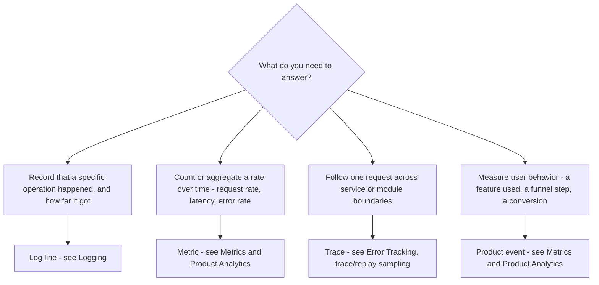

# Software Instrumentation

Use this capability whenever you instrument software to make its behavior observable — adding or reviewing the code that emits telemetry (logs, errors, traces, or product events) or that configures the tools those signals flow into. Instrumenting well is what turns a production incident from a guess into a lookup.

The guidance is deliberately tool-agnostic. It names roles — **your structured logger**, **your error tracker** (error-reporting service), **your analytics tool** — rather than specific SDKs, and the code snippets use placeholder function names such as `logger.info(...)`, `reportError(...)`, and `trackEvent(...)` that map onto whatever your project has adopted. Substitute the concrete names when applying a rule; keep the shape.

Observability rests on three signal types — **logs**, **metrics**, and **traces** — made actionable by disciplined **error handling** and a dedicated **error tracker**. Each reference below owns one of those concerns; load the ones the change touches.

## Choosing a Signal

Reach for the signal that answers the question you expect to ask in production, not the one that is easiest to add. The flow below routes a need to its signal and to the reference that owns it; **traces** are instrumented through the error tracker's tracing integration, so they live with error tracking.

An unexpected failure is not on this flow because it is not a fourth choice: report it to the error tracker (see Error Handling and Error Tracking), and let disciplined logging supply the breadcrumb trail that leads up to it.

## Error Handling

See [error-handling.md](./references/error-handling.md) for:

- Where to place try-catch blocks and how errors propagate to the root call site
- The caught-error decision flow — rethrow a control-flow signal, report an unexpected failure, then recover or rethrow
- Reporting caught errors before an early return, redirect, or fallback path
- Top-level error boundaries and writing actionable error messages

## Error Tracking

See [error-tracking.md](./references/error-tracking.md) for:

- Integrating an error-reporting service behind one project wrapper or init/config file
- Which failures are worth capturing and which are ordinary control flow
- Breadcrumbs, trace/replay sampling, and instrumentation boundaries
- Keeping secrets and PII out of telemetry event context

## Logging

See [logging.md](./references/logging.md) for:

- When an operation is worth logging and when it is noise
- The log-level decision flow, and choosing a level (`info` / `warn` / `debug`; `error` reserved for projects without an error tracker)
- Deriving module-scoped child loggers from one shared root logger
- Structured context objects and "Started / Completed" message conventions

## Metrics and Product Analytics

See [metrics-and-analytics.md](./references/metrics-and-analytics.md) for:

- Emitting metrics and product/usage events through one typed, centralized wrapper
- Stable event and property naming conventions
- Gating telemetry behind a runtime flag and honoring user consent
- Keeping PII and raw content out of event properties
