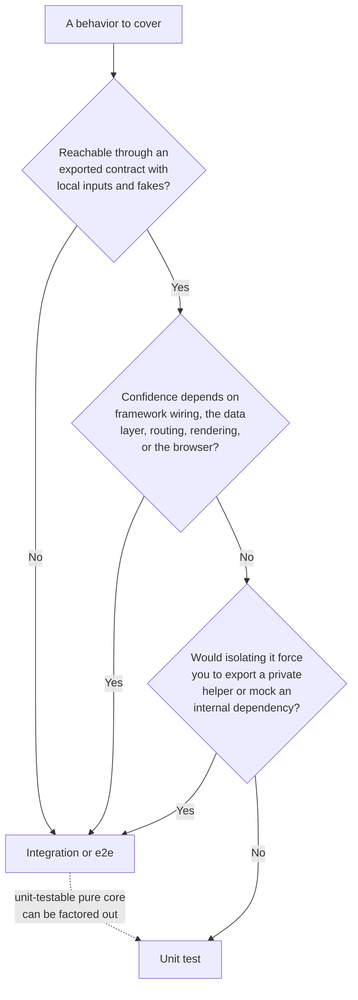

# Testing Scope

Unit tests are the right tool when a behavior can be exercised through an exported contract with local data and local fakes. They are the wrong tool when confidence depends on framework wiring, browser behavior, or how multiple pieces work together.

## Choosing the Test Level

Run a candidate behavior through this decision path before writing the test. The goal is to land each behavior at the _lowest_ level that still gives real confidence: a unit test when the contract is exercisable in isolation, an integration or e2e test the moment confidence depends on wiring, the data layer, or the browser.



The dashed edge is the common refactor: when a mostly-integration behavior hides a pure decision, extract that decision into an exported helper and unit-test it directly, while the wiring around it stays covered by the broader test.

**Concrete Examples:**

> Good unit target: `formatTags()` renders a tag array as a stable string.

> Good unit target: `RecordResponse` decodes both paginated and single-record responses from the data layer.

> Better integration/e2e target: a detail page renders data-layer content, formatted output, and route metadata correctly.

> Better integration/e2e target: a UI component depends on a third-party callback API, context provider, focus behavior, or user interaction timing.

**Guidelines:**

- MUST add or update unit tests when a non-trivial pure helper, schema, parser, serializer, validator, or handler changes.
- SHOULD use unit tests for boundary-value logic, schema defaults, validation failures, mutation safety, and handlers exercised with faked boundary objects.
- MUST NOT use unit tests as a substitute for e2e coverage when the changed surface is user-facing UI.
- SHOULD prefer integration or e2e coverage when confidence depends on routing, data-layer runtime behavior, browser APIs, rendering, providers, callbacks, or third-party UI behavior.
- SHOULD turn manual user instructions into automated checks when possible: identify the caller, perform the same public action, and assert the result the caller can observe.
- SHOULD keep unit tests fast, deterministic, and independent so they can run as a tight feedback loop.

## Callback And Component Boundaries

Components that accept callbacks or render children are easy to test badly because the tempting path is to extract the callback or mock the dependency that drives it. That tests implementation wiring instead of user-visible behavior.

**Good Direction:**

```ts
// Prefer testing a component through the rendered behavior users depend on.
// In most projects, route/component behavior belongs in integration or e2e tests.
```

**Avoid:**

```ts
// Avoid exporting a private callback only so a unit test can call it.
// Avoid mocking the third-party dependency just to inspect arguments.
```

**Guidelines:**

- MUST NOT extract and export private callback functions solely to make them unit-testable.
- MUST NOT mock a callback-driving dependency solely to inspect private callback arguments.
- SHOULD test component behavior through rendered output and user-visible interaction when callbacks, providers, or browser behavior are involved.
- SHOULD, when the unit under discussion is a component rather than a pure helper, defer to the project's end-to-end testing guidelines and to its own component or UI conventions where the project defines them.
