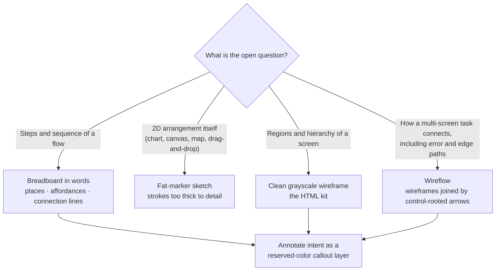

# Wireframe Design

This skill equips you to produce a **low-fidelity wireframe** — a breadboard mockup of any client-app UI, mobile or web/desktop. Reach for it to sketch a screen, breadboard a flow in words, connect screens into a wireflow, compare layout options, or run the wireframe round of a design review. It owns a **project-agnostic** breadboard vocabulary: two device canvases (a mobile phone frame and a browser window), the breadboard primitives, the component library, the archetypes, the annotation and wireflow layer, and the options-comparison layout — regions, hierarchy, and flow, never brand color or final type.

**High-fidelity (real-token) mockups** — rendering a chosen design with real brand color, type, spacing, and density — are a separate activity this skill does not cover; if the project has a skill for high-fidelity or visual UI design, defer to it for that round. When this skill runs inside a broader design-review or delivery workflow, that workflow owns how option rounds, the recommended marker, and any recording are handled; the general page craft of the surrounding page (its own typography, palette, and spacing rhythm) follows your host's page-craft guidance, when it has any.

The kit is [wireframe-kit.html](./assets/wireframe-kit.html) — a self-contained, theme-aware page carrying the two device canvases, the breadboard component library, the archetypes, the breadboard/wireflow/annotation layer, and the options-comparison layout. Copy it to a scratch location, delete the parts you are not presenting, fill it for the screen(s) at hand, then render, export, or publish the result — and validate it with the bundled [check-wireframe.mjs](./scripts/check-wireframe.mjs) before presenting.

The normative rules below are grounded in the external field consensus distilled in this skill's **Research-Grounded Best Practices** references (the routing section at the end of this document) — 18 principles across five topic files, each expanded with reasoning, do/don't examples, and citations to reputable sources (Nielsen Norman Group, the Interaction Design Foundation, Smashing Magazine, Basecamp's _Shape Up_, platform design systems). The MUST/SHOULD rules in this document are authoritative.

## Choosing the Artifact

Low fidelity is not one artifact — pick the cheapest one that answers the open question. Reach for the HTML kit only when the question is about a screen's regions and hierarchy; when the question is a flow's steps, breadboard it in words first, and when the 2D arrangement _is_ the question, a fat-marker sketch beats any tool.

**Guidelines:**

- MUST choose the artifact by the open question — breadboard flow-and-sequence questions in words, fat-marker sketch a 2D-arrangement question, wireframe a regions-and-hierarchy question, and wireflow a multi-screen task with branches — rather than reaching for the pixel kit by default.
- SHOULD escalate within low fidelity rather than jumping to real tokens: breadboard or sketch first, wireframe once the structure is settled, and keep every step in grayscale with placeholder labels.

## How to Use the Kit

The kit is a copy-and-fill starting point, not a library to import. Produce one page per wireframe you are presenting.

**Guidelines:**

- MUST start a wireframe from [wireframe-kit.html](./assets/wireframe-kit.html) rather than reinventing the format, so wireframes stay visually consistent across runs and authors.
- MUST copy the kit into a scratch location and build there, keeping the working file outside any source tree you would not want a throwaway mockup committed into.
- SHOULD NOT commit the kit-derived mockup or any render into a source repository; wireframes are disposable artifacts — attach them to the review or keep them in scratch, do not carry them in the codebase unless the human explicitly asks.
- MUST keep the produced page self-contained — no external fetches (no CDN fonts, scripts, or remote images); the kit uses system font stacks for exactly this reason.
- MUST fill every `<!-- FILL: ... -->` point with the wireframe's real content and remove leftover placeholder labels.
- SHOULD delete the components, states, canvases, and archetypes a wireframe does not use before presenting it, so it shows only the intended design.
- SHOULD follow your host's general page-craft guidance for the page that frames the mockups (its masthead, spacing, and type); this skill governs the mockup vocabulary, not the whole page.

## Validating the Output

The kit ships a dependency-light Node validator, [check-wireframe.mjs](./scripts/check-wireframe.mjs), that mechanically enforces two of the MUST rules a filled page must satisfy. Run `node scripts/check-wireframe.mjs <your-wireframe>.html` (it accepts multiple files) and fix any failure before presenting.

**Guidelines:**

- MUST run `check-wireframe.mjs` against the filled page and resolve every failure before presenting — it fails on any external resource fetch (a `src`/`srcset`, `<link href>`, `@import`, or CSS `url(...)` pointing at `http:`, `https:`, or a protocol-relative host), which breaks self-containment, and on any leftover `FILL:` marker or `lorem ipsum` placeholder text.
- MUST run it on your filled copy, not the un-filled kit: the kit deliberately carries `FILL:` markers and so is expected to fail until you have filled and pruned it.
- SHOULD treat the validator as a floor, not a ceiling — it cannot see hierarchy, grouping, or grayscale discipline, so still apply the research-grounded rules below.

## Device Canvases

The kit carries two canvases so the same breadboard vocabulary serves both major client-app form factors. Pick the one that matches the target app; a project may use one or both.

- **Mobile** — `.phone` > `.screen`: a phone device frame with a status bar, nav bar, and tab bar.
- **Web / desktop** — `.browser` (`.chrome`, `.win`): a browser/desktop window with a title bar and address pill, hosting web navigation (`.web-topnav` top bar, `.web-shell` sidebar layout, `.web-drawer` side drawer).

## Breadboard Primitives

A wireframe shows places, affordances, and flow — regions and their arrangement — not fonts, exact spacing, or final copy. The kit gives each primitive a class and a legend swatch so a reviewer can read the breadboard without a key.

| Primitive             | Class                                              | Reads as                                                            |
| --------------------- | -------------------------------------------------- | ------------------------------------------------------------------- |
| Mobile canvas         | `.phone` > `.screen`                               | a mobile device screen                                              |
| Browser canvas        | `.browser` (`.chrome`, `.win`)                     | a web/desktop window                                                |
| Header / nav bar      | `.navbar` (`.back`, `.title`)                      | top navigation with optional back affordance                        |
| App mark / icon block | `.w-mark`                                          | logo or feature icon                                                |
| Heading / label       | `.w-h` (`.lg`)                                     | a solid grey bar — emphasis text                                    |
| Body text line        | `.w-t` (`.w80`/`.w60`/`.w40`)                      | a lighter grey bar — running text                                   |
| Input field           | `.field` > `.box` (`.filled`/`.focus`/`.invalid`)  | a dashed box — a text input                                         |
| Button                | `.btn` (`.primary`/`.ghost`/`.danger`/`.sm`/`.lg`) | a solid fill; `.primary` uses the accent                            |
| Error row             | `.err` (`.dot` + `.ln`)                            | danger-tinted inline error                                          |
| Tab bar               | `.tabbar` > `.tab` (`.active`)                     | mobile bottom tabs; active tab uses the accent                      |
| List / settings group | `.group` > `.rows` > `.row` (`.danger`)            | grouped rows; `.danger` for destructive                             |
| Modal sheet           | `.modal-scrim` + `.sheet` (`.grabber`)             | a mobile bottom sheet over a dimmed screen                          |
| Inline card           | `.inline-card`                                     | content embedded in a card on the primary surface                   |
| Top nav (web)         | `.web-topnav` (`.brand`, `.links`, `.actions`)     | a web top navigation bar                                            |
| Sidebar layout (web)  | `.web-shell` (`.side`, `.main`)                    | a web app shell with a sidebar                                      |
| Side drawer (web)     | `.web-drawer` + `.scrim`                           | a panel sliding in from the edge                                    |
| Breadboard (words)    | `.breadboard` (`.place`, `.afford`, `.conn`)       | places, affordances, and connection lines in text                   |
| Wireflow arrow        | `.flowarrow` (`.alt`)                              | a transition rooted on a control; `.alt` is dashed for an edge path |
| Annotation callout    | `.anno` (`.anno-mark`, `.anno-note`)               | a numbered intent note in the reserved annotation color             |

**Guidelines:**

- MUST keep the whole page at breadboard fidelity: greys, dashed inputs, solid buttons, danger tint — never brand color (beyond the single accent/danger cue the primitives carry), final typography, or final copy.
- MUST include the legend when the wireframe uses the primitives, so the breadboard is self-explaining without a key.
- MUST signal destructive affordances with the danger primitive **and** an icon or label shape, never color alone, matching common accessibility intent.
- MUST render every annotation in the reserved annotation color (the kit's `--anno`, a hue distinct from both the accent and the danger tint so a note is never misread as an active element or an error), and reserve that color exclusively for the annotation layer.
- SHOULD reach for a primitive directly when no archetype or component fits, rather than bending one out of shape.

## Component Library

The kit opens with the common UI components client apps share (the shadcn-UI / Material vocabulary), grouped and laid out in isolation — the parts an author assembles into a screen when no archetype fits. Groups: _Foundations_ (heading/label, body text, avatar + stack, badge, divider, skeleton, mobile + web canvas); _Inputs & controls_ (text input, textarea, select — web and native-mobile variants, checkbox, radio group, switch, slider, date picker); _Buttons & menus_ (button, button group, dropdown menu, tooltip, progress); _Containers & navigation_ (card, sectioned navigation — grouped settings rows, tabs, pagination, carousel, empty state, message bubbles); _Data_ (table / data table); _Feedback_ (banner/alert incl. destructive, toast/sonner); _Navigation & overlays — mobile + web_ rendered inside device/browser frames (dialog, alert dialog, bottom sheet/drawer, bottom tabs; top nav bar, sidebar layout, side drawer for web). Each specimen is a `.wc-*`/`.web-*` breadboard part or a reuse of an existing primitive.

**Guidelines:**

- SHOULD assemble a novel screen from the library's components when no archetype fits, rather than bending an archetype out of shape.
- SHOULD show a component's relevant **states and variant axes** when they clarify the design — states (default, filled, focus, invalid/error, selected/checked, disabled), and where they apply importance (primary/secondary/tertiary), tone (neutral/accent/destructive), size (sm/md/lg), and loading. The library carries these as labeled rows, greys plus the single accent cue for selected/active/primary and the danger tint for invalid/destructive.
- MAY reach for a primitive directly when no component fits; MUST NOT let the catalog flatten genuinely different screens into the same shape (templated sameness).
- SHOULD delete the components and states a wireframe does not use before presenting it.

## Breadboards, Wireflows, and Annotations

Beyond single screens, the kit carries the three artifacts that answer flow-and-intent questions: a **breadboard** (places, affordances, and connection lines in words, for when the layout is not yet the question), a **wireflow** (wireframes joined by arrows rooted on the exact control that drives each transition, with a dashed variant for alternative and edge paths), and an **annotation** layer (numbered callouts in the reserved annotation color that carry intent the grey boxes cannot).

**Guidelines:**

- SHOULD breadboard a flow in words before wireframing it when the open question is topology and sequence, tracing every affordance to a landing place so a dead end shows up before any layout exists.
- MUST root every wireflow transition on the specific control that triggers it and draw the alternative branch for each decision point — invalid input, empty results, failure, permission denial, and Back — not only the success path, using the dashed `.alt` arrow for those edge paths.
- MUST restrict annotations to what raises questions — dynamic or conditional content, business logic, non-standard patterns, edge and empty states, accessibility behavior, and each primary action's outcome — and keep each note to a scannable phrase, never annotating what a competent reader infers on sight.

## Archetypes

The kit ships assembled breadboards for common screens in **both canvases** — mobile (empty state, form with error, settings/list group, tab-bar states, modal sheet, inline card) and web/desktop (app shell with nav + sidebar, form page, table/list page, modal dialog). They are **optional starting points**, present to speed authoring, not a required catalog.

**Guidelines:**

- MAY start from an archetype and adapt it; MUST NOT let the catalog flatten genuinely different screens into the same shape.
- MUST delete archetypes the wireframe does not use before presenting it.
- SHOULD add a one-line caption under each screen naming its regions, as the kit does, so the intent survives at breadboard fidelity.
- SHOULD note per screen how its layout adapts across device sizes (small phones, large phones, tablets, desktop widths) when it materially differs, using content-derived breakpoints (see the responsive-and-platform reference).

## Options-Comparison Layout

When a wireframe is presented as a set of options to choose between, the comparison must let the reviewer weigh candidates side by side. The kit's `.grid-options` renders each option as a `.card` with a label, a mockup (in either canvas), a rationale, and its trade-offs; the recommended option gets `.card.rec` and a `.badge`.

**Guidelines:**

- SHOULD present at least three options, each differing on a structural axis — hierarchy, layout, or visual treatment — not merely decoration.
- SHOULD give every option a sketch, a rationale, and its trade-offs, and mark exactly one recommended.
- SHOULD make every non-recommended option a genuinely implementable alternative, never a straw-man that exists only to lose.
- SHOULD render screens shared across all options once, above the option grid, rather than repeating them in each card.
- When used inside a broader design-review or delivery workflow, follow that workflow's conventions for how the options round is recorded and how the recommended option is marked.

## Research-Grounded Best Practices

These references distill the external field consensus behind this skill's rules, one topic per file, each with expanded guidance, do/don't examples, and citations. The MUST/SHOULD rules elsewhere in this document remain authoritative.

See [fidelity-and-intent.md](./references/fidelity-and-intent.md) for:

- matching fidelity (interactivity, polish, scope, content) to the question you are answering
- keeping the aesthetic deliberately rough so reviewers critique structure, not pixels
- reaching 'rough but solved' and holding every screen at the same finish level

See [process-and-collaboration.md](./references/process-and-collaboration.md) for:

- testing rough versions before code and generating multiple alternatives before converging
- declaring what is out of scope and involving cross-functional collaborators early
- using progressive fidelity to manage stakeholder feedback and signal how settled the thinking is

See [structure-and-content.md](./references/structure-and-content.md) for:

- establishing information architecture and hierarchy first, and breadboarding flows with words
- grouping with spacing and common region before adding enclosures
- using real or realistic content instead of lorem ipsum

See [flow-and-annotation.md](./references/flow-and-annotation.md) for:

- designing connected flows rather than isolated screens
- annotating intent as distinct, non-UI callouts
- keeping a consistent, reusable visual shorthand across screens

See [responsive-and-platform.md](./references/responsive-and-platform.md) for:

- wireframing mobile-first at real device scale and thumb reach
- setting breakpoints from content and adapting navigation per platform
